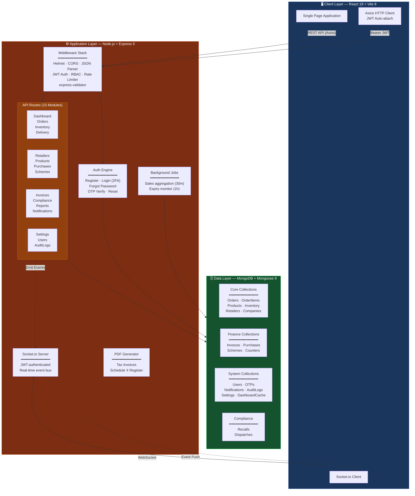
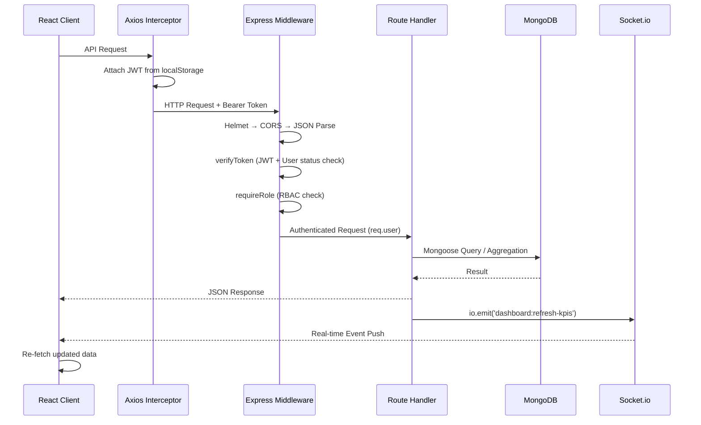
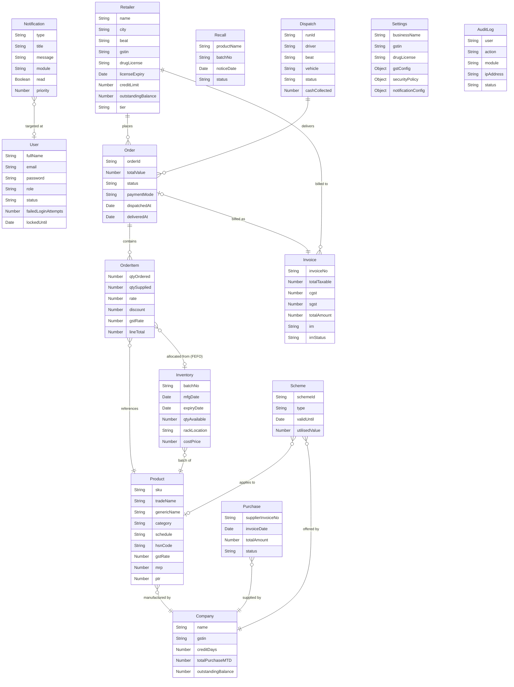
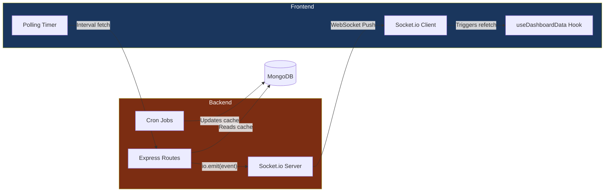
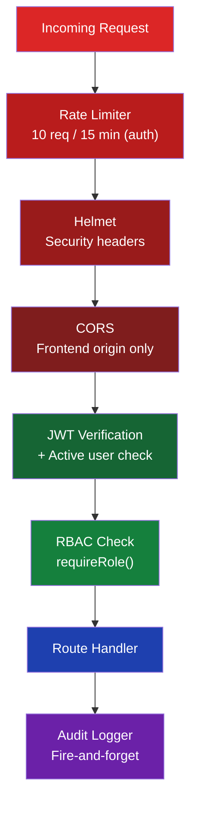

<p align="center">
  
  
  
  
  
  
</p>

# 💊 Aadhya Pharmex — Pharmaceutical Distribution Management System

> An enterprise-grade, full-stack **Pharmaceutical Distribution Management System (DMS)** built on the MERN stack. Designed to streamline the complete pharmaceutical supply chain — from purchase & inventory management to order fulfillment, GST-compliant invoicing, delivery logistics, and regulatory compliance tracking.

---

## 📋 Table of Contents

- [Overview](#-overview)
- [System Architecture](#-system-architecture)
- [Data Model (ER Diagram)](#-data-model)
- [Feature Breakdown](#-feature-breakdown)
- [API Architecture](#-api-architecture)
- [Real-Time Engine](#-real-time-engine)
- [Security Architecture](#-security-architecture)
- [Tech Stack](#-tech-stack)
- [Project Structure](#-project-structure)
- [Getting Started](#-getting-started)
- [Environment Variables](#-environment-variables)
- [Default Credentials](#-default-credentials)
- [License](#-license)

---

## 🔭 Overview

Aadhya Pharmex DMS provides complete control over the pharmaceutical distribution lifecycle:

| Domain | Capabilities |
|--------|-------------|
| **Inventory** | FEFO (First Expiry, First Out) batch tracking, multi-item GRN processing, rack location mapping |
| **Orders** | Credit-limit enforcement, atomic stock allocation, order state machine with validation |
| **Delivery** | Beat-based auto-dispatch, driver assignment, delivery cascade with cash collection |
| **Billing** | GST-compliant tax invoicing, PDF generation, GSTR-1 CSV export, atomic invoice numbering |
| **Compliance** | Drug license monitoring, Schedule H/H1/X register, drug recall tracking, audit trail |
| **Analytics** | Real-time KPI dashboard, WebSocket-driven updates, cron-computed aggregations |
| **Security** | 2FA (OTP-based), JWT with dynamic expiry, RBAC, account lockout, rate limiting |

---

## 🏗 System Architecture



### Request Flow



---

## 📊 Data Model

The system uses **18 Mongoose schemas** organized across 4 domains:



---

## ✨ Feature Breakdown

### 🏠 Dashboard (Real-Time)
- **6 KPI cards** — Today's orders, pending deliveries, active retailers, total revenue, low stock alerts, today's sales value
- **Weekly sales bar chart** — 7-day sales trend with highlighted current day
- **Monthly revenue trend** — Financial year (Apr–Mar) bar chart
- **Sales by company** — Interactive donut chart with percentage breakdown
- **Top products** — Today's top 5 by volume
- **Recent orders table** — Last 5 orders with status badges
- **Real-time updates** via Socket.io + 5-minute polling fallback

### 📦 Order Management
- **FEFO batch allocation** — Atomic inventory decrement sorted by expiry date
- **Credit limit enforcement** — Auto `Credit Hold` status when exceeding retailer limits
- **Order state machine** with validated transitions:
  ```
  Pending → Confirmed → Dispatched → Delivered (terminal)
  Pending → Cancelled (terminal)
  Credit Hold → Pending / Confirmed / Cancelled
  ```
- **Paginated listing** with status filter chips and city/date/retailer filters
- **Real-time order event broadcasting** via WebSocket

### 📋 Inventory & GRN
- **Batch-level tracking** with expiry date, rack location, cost price
- **Multi-item GRN processing** — Single form creates:
  - Inventory batch documents (always new for lot traceability)
  - Purchase record with line items
  - Supplier balance & MTD increments
  - Product PTR catalog updates
- **Duplicate invoice guard** — Unique composite index on `supplierId + supplierInvoiceNo`
- **Product-grouped view** for quick stock assessment

### 🚚 Delivery & Dispatch
- **Auto-dispatch** — Assign all confirmed orders for a beat to a driver
- **Manual dispatch** — Cherry-pick specific orders
- **Delivery cascade** — Completing a dispatch cascades `Delivered` status to all orders with:
  - Individual per-order error handling
  - Retailer outstanding balance updates
- **KPI tracking** — Cash collected, orders per run

### 🏪 Retailer CRM
- **Tiered classification** — Standard, Silver, Gold, Platinum
- **Credit management** — Configurable credit limits and credit days
- **Drug license tracking** — License number and expiry monitoring
- **Outstanding balance ledger** — Automatic updates on delivery

### 💰 Billing & GST
- **Atomic sequential invoice numbers** — `INV/26-27/XXXX` via MongoDB Counter model
- **GST computation** — Per-line-item CGST/SGST split calculation
- **PDF invoice generation** — Complete tax invoice with:
  - Seller/buyer details from Settings
  - Line item table with HSN, batch, expiry, GST
  - Bank details footer
  - Terms & conditions
- **GSTR-1 export** — B2B CSV format grouped by GST rate buckets
- **Duplicate invoice prevention** — Unique constraint on `orderId`

### ✅ Compliance
- **Drug license expiry tracker** — Valid / Expiring (90d, 30d) / Expired breakdown
- **Schedule H/H1/X monitoring** — Today's transaction counts and units dispensed
- **Schedule X register** — Full audit trail with PDF export (landscape A4)
- **Drug recall management** — Create, track, resolve recalls
- **Active recall count** on compliance dashboard

### 📊 Reports & MIS
Six downloadable CSV reports:
| Report | Endpoint | Content |
|--------|----------|---------|
| Near Expiry | `/api/reports/near-expiry?days=60` | Batches expiring within N days |
| Daily Sales | `/api/reports/daily-sales` | Today's dispatched/delivered orders |
| Outstanding Aging | `/api/reports/aging` | Retailers with outstanding balances |
| Scheme Utilisation | `/api/reports/schemes` | Company scheme status |
| Profit & Loss | `/api/reports/pnl` | Monthly sales vs purchases (FY) |
| Purchase Register | `/api/reports/purchases` | All purchase history |

### 🎯 Scheme Management
- **Two scheme types** — Free Goods (buy X get Y) and Discount (percentage)
- **Computed status** at read-time — Active / Expiring (30d) / Expired
- **Atomic scheme ID generation** — `SCH-XXXX` via Counter model
- **Company and product-level targeting**

### ⚙️ Settings (Admin Panel)
- **Company information** — Business name, address, GSTIN, drug license, state
- **Bank details** — Account name/number, IFSC, bank name
- **GST configuration** — e-Invoice toggle, e-Way Bill threshold, GSTR-1 frequency, tax computation mode, rounding method
- **Notification preferences** — Per-event channel config (in-app, email, SMS), threshold days, digest schedules
- **Security policy** — Password length, expiry, session timeout, concurrent logins, lockout threshold, IP whitelist
- **User management** — Create, edit, deactivate users with role assignment
- **Audit log viewer** — Filterable log with CSV export
- **Data export** — Full company data export (DPDP compliance)

### 👤 User & Profile Management
- **Self-service profile editing** — Name, email, phone, branch, password change
- **Password verification required** for all profile changes
- **User CRUD** — Admin can create users with default password (`Welcome@123`)
- **Soft deactivation** — Records `deactivatedAt` and `deactivatedBy`

---

## 🔌 API Architecture

### Authentication Endpoints (in `server.js`)

| Method | Endpoint | Description |
|--------|----------|-------------|
| `POST` | `/api/auth/register` | User registration |
| `POST` | `/api/auth/login` | Step 1: Validate credentials, send OTP |
| `POST` | `/api/auth/login-verify` | Step 2: Verify OTP, return JWT |
| `POST` | `/api/auth/forgot-password` | Request password reset OTP |
| `POST` | `/api/auth/verify-otp` | Verify reset OTP |
| `POST` | `/api/auth/reset-password` | Set new password |

### Protected API Routes (15 Modules)

All routes require JWT authentication via `Authorization: Bearer <token>` header.

<details>
<summary><strong>📊 Dashboard Routes</strong> — <code>/api/dashboard</code></summary>

| Method | Endpoint | Description |
|--------|----------|-------------|
| `GET` | `/kpis` | Today's KPIs (orders, sales, retailers, stock, revenue) |
| `GET` | `/alerts` | Expiring inventory, licenses, GSTR-1 due |
| `GET` | `/sales` | Weekly sales (cached, 30min TTL) |
| `GET` | `/top-products` | Today's top 5 products by volume |
| `GET` | `/sales/by-company` | MTD company sales breakdown (cached) |
| `GET` | `/monthly-sales` | FY monthly revenue trend |

</details>

<details>
<summary><strong>📦 Order Routes</strong> — <code>/api/orders</code></summary>

| Method | Endpoint | Description |
|--------|----------|-------------|
| `POST` | `/` | Create order with FEFO allocation |
| `PATCH` | `/:id/status` | Update order status (state machine) |
| `GET` | `/` | List orders (filter, paginate) |

</details>

<details>
<summary><strong>📋 Inventory Routes</strong> — <code>/api/inventory</code></summary>

| Method | Endpoint | Description |
|--------|----------|-------------|
| `GET` | `/` | Inventory grouped by product |
| `GET` | `/batches` | Batch-level inventory |
| `POST` | `/grn` | Record GRN (multi-item) |
| `PATCH` | `/batches/:id` | Edit batch rack/cost |

</details>

<details>
<summary><strong>🚚 Delivery Routes</strong> — <code>/api/delivery</code></summary>

| Method | Endpoint | Description |
|--------|----------|-------------|
| `GET` | `/` | List all dispatches |
| `POST` | `/` | Create dispatch (auto/manual) |
| `PATCH` | `/:id/status` | Update dispatch + cascade deliveries |

</details>

<details>
<summary><strong>💰 Invoice Routes</strong> — <code>/api/invoices</code></summary>

| Method | Endpoint | Description |
|--------|----------|-------------|
| `GET` | `/` | List all invoices |
| `GET` | `/unbilled-orders` | Delivered orders without invoices |
| `POST` | `/` | Generate GST invoice |
| `GET` | `/:id/pdf` | Download invoice PDF |
| `GET` | `/gstr1-export` | Download GSTR-1 CSV |

</details>

<details>
<summary><strong>✅ Compliance Routes</strong> — <code>/api/compliance</code></summary>

| Method | Endpoint | Description |
|--------|----------|-------------|
| `GET` | `/summary` | License + schedule + recall stats |
| `GET` | `/schedule-x-register` | Schedule X register (JSON) |
| `GET` | `/schedule-x-register/pdf` | Schedule X register (PDF) |
| `GET` | `/recalls` | List recalls |
| `POST` | `/recalls` | Create recall |
| `PUT` | `/recalls/:id/resolve` | Resolve recall |
| `DELETE` | `/recalls/:id` | Delete recall |

</details>

<details>
<summary><strong>📊 Reports Routes</strong> — <code>/api/reports</code></summary>

| Method | Endpoint | Description |
|--------|----------|-------------|
| `GET` | `/near-expiry?days=60` | Near expiry CSV |
| `GET` | `/daily-sales` | Daily sales CSV |
| `GET` | `/aging` | Outstanding aging CSV |
| `GET` | `/schemes` | Scheme utilisation CSV |
| `GET` | `/pnl` | Profit & Loss CSV |
| `GET` | `/purchases` | Purchase register CSV |

</details>

<details>
<summary><strong>⚙️ Other Routes</strong></summary>

| Base Path | Key Endpoints |
|-----------|---------------|
| `/api/retailers` | `GET /`, `POST /`, `PATCH /:id` |
| `/api/products` | `GET /` (master catalog), `GET /companies` |
| `/api/purchases` | `GET /` (list all) |
| `/api/schemes` | `GET /`, `POST /`, `DELETE /:id` |
| `/api/notifications` | `GET /`, `PATCH /:id/read`, `POST /mark-all-read` |
| `/api/settings` | `GET /`, `PUT /company`, `PUT /gst`, `PUT /notifications`, `PUT /security`, `GET /export` |
| `/api/users` | `GET /`, `POST /`, `PUT /:id`, `PUT /profile`, `PATCH /:id/deactivate` |
| `/api/audit-logs` | `GET /` (filtered), `GET /export` (CSV) |

</details>

---

## ⚡ Real-Time Engine

The system uses a dual-channel real-time strategy:



### WebSocket Events

| Event | Trigger | Action |
|-------|---------|--------|
| `dashboard:refresh-kpis` | Order created/updated, GRN, dispatch | Re-fetch all KPIs + charts |
| `orders:new` | New order placed | Dashboard notification |
| `order:status-updated` | Status change | Update order in list |
| `inventory:updated` | GRN recorded, batch edited | Refresh inventory view |
| `purchases:updated` | GRN recorded | Refresh purchase list |
| `schemes:updated` | Scheme created/deleted | Refresh scheme list |
| `compliance:updated` | Recall created | Refresh compliance view |

### Polling Intervals

| Data | Interval | Purpose |
|------|----------|---------|
| KPIs | 5 minutes | Fallback for missed WebSocket events |
| Alerts | 10 minutes | Low-frequency compliance data |
| Notification count | 30 seconds | Header bell badge |

---

## 🔒 Security Architecture



| Layer | Implementation | Details |
|-------|---------------|---------|
| **Password Hashing** | bcrypt (12 rounds) | Industry-standard adaptive hashing |
| **2FA** | OTP-based | 4-digit, bcrypt-hashed, TTL-indexed auto-expiration |
| **JWT** | Dynamic expiry | Session timeout configurable via Settings (default: 60 min) |
| **Account Lockout** | Configurable threshold | Default: 5 failed attempts → 15 min lock |
| **Rate Limiting** | express-rate-limit | 10 requests per 15 minutes on auth endpoints |
| **RBAC** | Middleware-based | Roles: `Super Admin`, `Admin`, `Manager`, `Operations Manager` |
| **Token Validation** | Per-request | Checks user active status in DB on every authenticated request |
| **Security Headers** | Helmet | XSS, clickjacking, MIME sniffing protection |
| **CORS** | Origin whitelist | Only configured frontend URL allowed |
| **Audit Trail** | Async logging | All auth events, settings changes, user operations logged |
| **Auto-Logout** | Axios interceptor | Frontend auto-clears session on `AUTH_EXPIRED` / `AUTH_INVALID` |

---

## 🛠 Tech Stack

### Backend (`pharma-api`)

| Technology | Version | Purpose |
|-----------|---------|---------|
| Node.js | 18+ | Runtime |
| Express | 5.x | Web framework |
| Mongoose | 9.x | MongoDB ODM |
| Socket.io | 4.x | WebSocket server |
| jsonwebtoken | 9.x | JWT authentication |
| bcryptjs | 3.x | Password hashing |
| node-cron | 3.x | Background job scheduling |
| PDFKit | 0.19.x | PDF generation |
| helmet | 8.x | Security headers |
| express-rate-limit | 8.x | Rate limiting |
| express-validator | 7.x | Input validation |
| cors | 2.x | Cross-origin resource sharing |
| dotenv | 17.x | Environment configuration |

### Frontend (`pharma-app`)

| Technology | Version | Purpose |
|-----------|---------|---------|
| React | 19.x | UI framework |
| Vite | 8.x | Build tool & dev server |
| Axios | 1.x | HTTP client |
| Socket.io-client | 4.x | WebSocket client |
| Framer Motion | 12.x | Animations |
| Tabler Icons | CDN | Icon library |

---

## 📁 Project Structure

```
📦 Pharmaceutical-Distribution-Management-System
├── 📂 pharma-api/                    # Backend API server
│   ├── 📂 models/                    # 18 Mongoose schemas
│   │   ├── User.js                   #   Auth & RBAC
│   │   ├── Otp.js                    #   2FA tokens (TTL)
│   │   ├── Order.js                  #   Sales orders
│   │   ├── OrderItem.js              #   Line items (FEFO)
│   │   ├── Product.js                #   Master catalog
│   │   ├── Inventory.js              #   Batch-level stock
│   │   ├── Retailer.js               #   Downstream CRM
│   │   ├── Company.js                #   Upstream suppliers
│   │   ├── Invoice.js                #   GST invoices
│   │   ├── Purchase.js               #   GRN records
│   │   ├── Dispatch.js               #   Delivery runs
│   │   ├── Scheme.js                 #   Promotions
│   │   ├── Recall.js                 #   Drug recalls
│   │   ├── Notification.js           #   In-app alerts (TTL)
│   │   ├── DashboardCache.js         #   Aggregation cache (TTL)
│   │   ├── AuditLog.js               #   Compliance trail
│   │   ├── Settings.js               #   Global config singleton
│   │   └── Counter.js                #   Atomic sequences
│   ├── 📂 routes/                    # 15 Express router modules
│   │   ├── dashboard.js              #   KPIs, charts, alerts
│   │   ├── orders.js                 #   CRUD + FEFO allocation
│   │   ├── inventory.js              #   Stock + GRN processing
│   │   ├── delivery.js               #   Dispatch management
│   │   ├── retailers.js              #   Retailer CRM
│   │   ├── products.js               #   Product catalog
│   │   ├── purchases.js              #   Purchase history
│   │   ├── invoices.js               #   Billing + PDF + GSTR-1
│   │   ├── schemes.js                #   Promotions CRUD
│   │   ├── compliance.js             #   Regulatory tracking
│   │   ├── reports.js                #   CSV report exports
│   │   ├── notifications.js          #   Alert management
│   │   ├── settings.js               #   System configuration
│   │   ├── users.js                  #   User management
│   │   └── auditLogs.js              #   Audit trail viewer
│   ├── 📂 middleware/
│   │   ├── auth.js                   #   JWT verification
│   │   ├── requireRole.js            #   RBAC enforcement
│   │   └── validate.js               #   Input validation
│   ├── 📂 cron/
│   │   └── jobs.js                   #   Background schedulers
│   ├── 📂 utils/
│   │   └── audit.js                  #   Async audit logging
│   ├── server.js                     #   Entry point + auth routes
│   ├── seed.js                       #   Database seeder
│   ├── package.json
│   └── .env                          #   Environment config
│
├── 📂 pharma-app/                    # Frontend SPA
│   ├── 📂 src/
│   │   ├── 📂 pages/                 # 13 page components
│   │   │   ├── DashboardPage.jsx     #   Real-time KPI dashboard
│   │   │   ├── OrdersPage.jsx        #   Order management
│   │   │   ├── InventoryPage.jsx     #   Stock tracking
│   │   │   ├── DeliveryPage.jsx      #   Dispatch control
│   │   │   ├── RetailersPage.jsx     #   Retailer CRM
│   │   │   ├── PurchasePage.jsx      #   Purchase history
│   │   │   ├── SchemesPage.jsx       #   Promotions
│   │   │   ├── BillingPage.jsx       #   Invoicing & GST
│   │   │   ├── CompliancePage.jsx    #   Regulatory compliance
│   │   │   ├── ReportsPage.jsx       #   CSV report downloads
│   │   │   ├── SettingsPage.jsx      #   Admin settings panel
│   │   │   ├── EditProfilePage.jsx   #   Profile management
│   │   │   └── PharmaAuth.jsx        #   Auth flow (2FA)
│   │   ├── 📂 components/
│   │   │   ├── layout.jsx            #   Sidebar + Header
│   │   │   ├── ui.jsx                #   Reusable UI primitives
│   │   │   ├── charts.jsx            #   Bar, Donut, Progress
│   │   │   └── modals.jsx            #   9 data-entry modals
│   │   ├── 📂 hooks/
│   │   │   └── useDashboardData.js   #   Real-time data hook
│   │   ├── 📂 api/
│   │   │   └── axios.js              #   HTTP client config
│   │   ├── App.jsx                   #   Root component + routing
│   │   ├── main.jsx                  #   React entry point
│   │   ├── theme.js                  #   Design token system
│   │   ├── navConfig.js              #   Navigation structure
│   │   ├── mockData.js               #   Sample data
│   │   └── index.css                 #   Global styles
│   ├── index.html                    #   HTML shell
│   ├── vite.config.js                #   Vite configuration
│   ├── tailwind.config.js            #   Tailwind (dev dependency)
│   └── package.json
│
└── README.md                         #   This file
```

---

## 🚀 Getting Started

### Prerequisites

- **Node.js** v18 or higher
- **MongoDB** server running locally on port `27017`
- **Git** for version control

### Installation & Running

1. **Clone the repository**
   ```bash
   git clone https://github.com/Arshitraj-123/Pharmaceutical-Distribution-Management-System.git
   cd Pharmaceutical-Distribution-Management-System
   ```

2. **Start the Backend**
   ```bash
   cd pharma-api
   npm install
   node server.js
   ```
   The API server will start on `http://localhost:3000`

3. **Start the Frontend** (in a new terminal)
   ```bash
   cd pharma-app
   npm install
   npm run dev
   ```
   The React app will start on `http://localhost:5173`

4. **Open the application**
   Navigate to `http://localhost:5173` in your browser.

---

## 🔐 Environment Variables

Create a `.env` file in the `pharma-api/` directory:

```env
MONGO_URI=mongodb://127.0.0.1:27017/pharma
JWT_SECRET=your_super_secret_key_here
PORT=3000
NODE_ENV=development
FRONTEND_URL=http://localhost:5173
```

---

## 🔑 Default Credentials

On first startup, the system automatically seeds:

| Field | Value |
|-------|-------|
| **Email** | `admin@adhyapharma.in` |
| **Password** | `Password123!` |
| **Role** | Admin |

> ⚠️ **Important:** Change the default password immediately after first login.

---

## 📄 License

© Aadhya Pharmex 2026. All Rights Reserved.
