# Aadhya Pharmex Distribution DMS

A comprehensive, responsive Pharmaceutical Distribution Management System (DMS) built with the MERN stack (MongoDB, Express, React, Node.js). 

## Overview
Aadhya Pharmex DMS is an enterprise-grade application designed to streamline pharmaceutical supply chains, offering complete control over:
- Live Inventory and Stock Allocation
- Real-time Dashboard with WebSocket (Socket.io) Updates
- Delivery Tracking and Dispatch Control
- Retailer Network Management
- Purchase and GRN Processing
- Scheme and Promotion Management
- GST, Billing, and Regulatory Compliance Tracking (Automated Cron Jobs)

## Architecture

```mermaid
graph TD
    %% Client Layer
    subgraph ClientLayer["Client Layer (React.js Vite — responsive web application)"]
        A[Admin dashboard<br/>Live KPIs and charts]
        B[Orders and inventory<br/>FEFO batch tracking]
        C[Retailers and billing<br/>CRM and GST invoicing]
    end
    
    ClientLayer -- "REST API + WebSocket" --> AppLayer
    
    %% Application Layer
    subgraph AppLayer["Application Layer (Node.js + Express.js — RESTful API server)"]
        D[JWT authentication<br/>bcrypt + OTP 2FA]
        E[Business logic<br/>Credit checks, atomic FEFO]
        F[Socket.io engine<br/>Real-time dashboard sync]
        G[Node-cron background jobs<br/>Sales aggregation + expiry alerts]
        H[GST compliance engine<br/>e-Invoice, e-Way Bill, GSTR-1]
    end
    
    AppLayer -- "Mongoose ODM queries" --> DataLayer
    
    %% Data Layer
    subgraph DataLayer["Data Layer (MongoDB — indexed collections)"]
        I[Orders & Order items]
        J[Products & Inventory batches]
        K[Retailers & Companies]
        L[Invoices & Notifications]
        M[Users & OTP records]
        N[Dashboard cache TTL indexed]
        O[Settings, AuditLogs, Schemes, Recalls]
        P[Compound indexes on createdAt, expiryDate, licenseExpiry, status]
    end

    %% Styles
    style ClientLayer fill:#0B4F8C,stroke:#0B4F8C,color:#fff
    style A fill:#075940,stroke:#268565,color:#fff
    style B fill:#075940,stroke:#268565,color:#fff
    style C fill:#075940,stroke:#268565,color:#fff

    style AppLayer fill:#753119,stroke:#753119,color:#fff
    style D fill:#875A18,stroke:#A87932,color:#fff
    style E fill:#875A18,stroke:#A87932,color:#fff
    style F fill:#875A18,stroke:#A87932,color:#fff
    style G fill:#7F253F,stroke:#A63D5D,color:#fff
    style H fill:#7F253F,stroke:#A63D5D,color:#fff

    style DataLayer fill:#265C10,stroke:#265C10,color:#fff
    style I fill:#4D4D4D,stroke:#666666,color:#fff
    style J fill:#4D4D4D,stroke:#666666,color:#fff
    style K fill:#4D4D4D,stroke:#666666,color:#fff
    style L fill:#4D4D4D,stroke:#666666,color:#fff
    style M fill:#4D4D4D,stroke:#666666,color:#fff
    style N fill:#4D4D4D,stroke:#666666,color:#fff
    style O fill:#1c420b,stroke:#3b821c,color:#fff
```



## Features
- **Frontend App (`pharma-app`):** Built with React 19 + Vite 6. Features a beautifully styled, custom UI using `theme.js` with responsive layouts, comprehensive modals, and dynamic KPI charts. Uses a custom `useDashboardData` hook for real-time polling and WebSocket synchronization.
- **Backend API (`pharma-api`):** Built with Node.js and Express. Connects to MongoDB via Mongoose. Protected by JWT middleware.
- **Role-Based Access Control (RBAC):** Extensive permissions logic utilizing granular `requireRole` middleware to protect admin and manager routes.
- **Real-Time Engine:** Uses `Socket.io` to instantly push order updates to connected clients.
- **Background Cron Jobs:** Powered by `node-cron` to automatically compute heavy sales aggregations every 30 minutes, and to monitor expiring inventory and drug licenses every hour to generate notifications.
- **Delivery & Logistics Module:** Full dispatch control with exact beat-to-retailer mapping, driver assignment, live KPI tracking, and granular per-order fulfillment cascades with integrated UI modals.
- **Audit Logging & Settings:** Centralized tracking of critical actions (e.g., auth events, config updates) mapped to users, and comprehensive global settings configuration.
- **Profile Management:** Fully integrated user profile editing with strict backend password verification requirements.
- **Modals System:** A highly interactive experience for creating new orders, stocks, dispatches, retailers, purchases, schemes, and invoices directly from the dashboard.

## Project Structure
The repository contains two main directories:
1. `pharma-app/` - The React frontend application.
   - `src/pages/` - Dashboard, Orders, Inventory, Delivery, Retailers, Purchase, Schemes, Billing, Compliance, Settings, Auth.
   - `src/components/` - Reusable UI components including Layout, Charts, Modals, and standard UI elements.
   - `src/hooks/` - Contains real-time custom hooks (e.g., `useDashboardData.js`).
2. `pharma-api/` - The Node.js/Express backend server.
   - `models/` - 18 Mongoose schemas (User, Otp, Order, OrderItem, Product, Inventory, Retailer, Invoice, Company, Notification, DashboardCache, Dispatch, AuditLog, Settings, Scheme, Recall, Purchase, Counter).
   - `routes/` - Specific endpoint routers (e.g., `dashboard.js`, `delivery.js`, `auditLogs.js`, `settings.js`, `users.js`).
   - `cron/` - Background schedule definitions.
   - `middleware/` - JWT authentication guards and RBAC (`requireRole.js`).
   - `utils/` - Utility functions (e.g., `audit.js`).
   - `server.js` - Main Express/Socket.io server entry point.

## Tech Stack
- **Frontend Framework:** React 19 + Vite 6
- **Backend Framework:** Node.js + Express
- **Database:** MongoDB + Mongoose
- **Real-time & Background:** Socket.io + Node-Cron
- **Styling:** Vanilla CSS (`index.css`) + Custom Design System (`theme.js`)
- **Icons:** Tabler Icons

## Getting Started

### Prerequisites
- Node.js (v18+ recommended)
- MongoDB Server running locally on port 27017

### Installation & Running

1. **Clone the repository**
   ```bash
   git clone https://github.com/Arshitraj-123/Adhya-Pharmex.git
   ```

2. **Start the Backend**
   ```bash
   cd Adhya-Pharmex/pharma-api
   npm install
   node server.js
   ```

3. **Start the Frontend** (in a new terminal)
   ```bash
   cd Adhya-Pharmex/pharma-app
   npm install
   npm run dev
   ```

## License
© Aadhya Pharmex 2026. All Rights Reserved.
